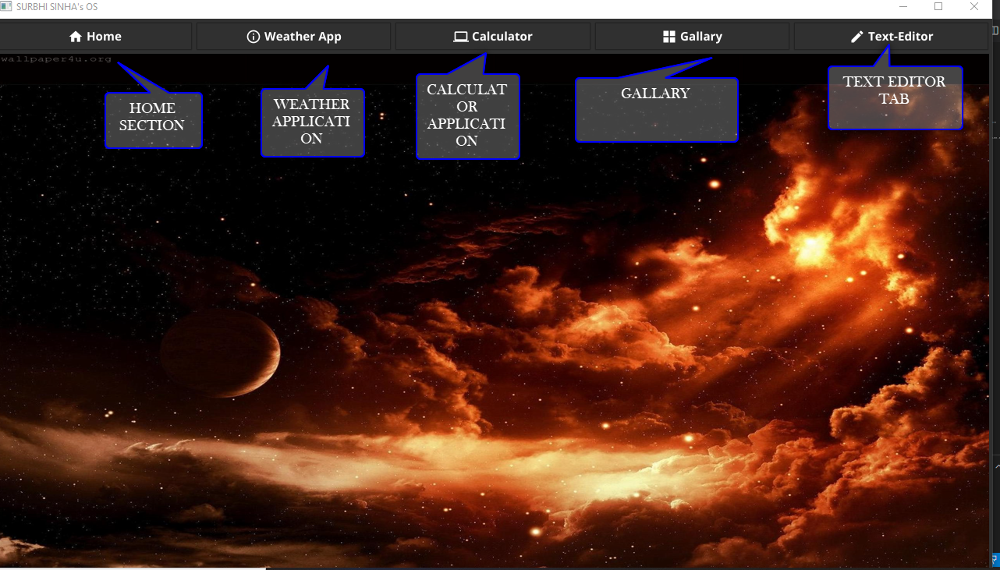
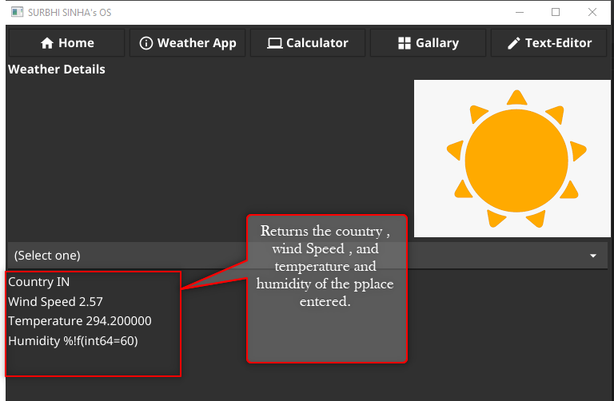
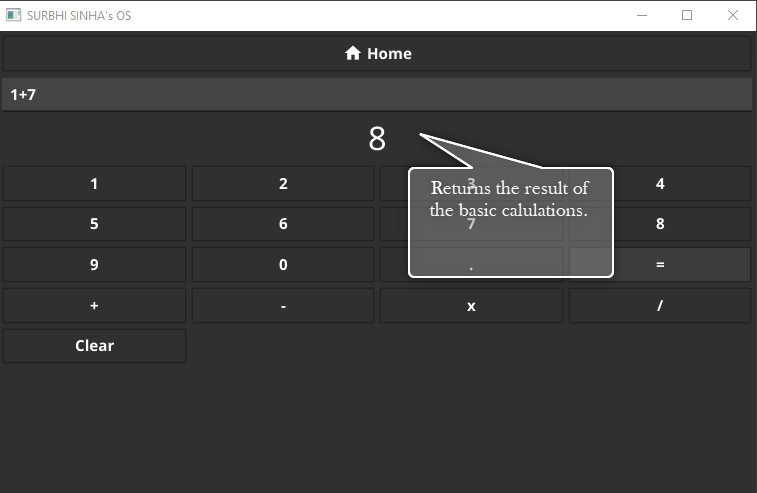
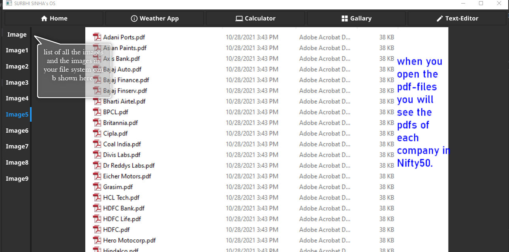
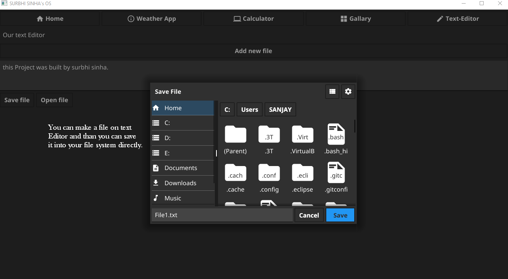

# Virtual-Operating-System
This is a Virtual Operating System made by using GOLANG and FYNE.


Hello! All
In this project I have made a virtual Operating system by using golang and fyne it consist of four apps TEXT EDITOR , GALLARY , CALCULATOR , WEATHER APPLICATION . 

## Instructions for running the code.
First make sure that you have properly downloaded the GOLANG [visit](https://golang.org/).
for complete instruction for downloading the Fyne please  [visit](https://developer.fyne.io/index.html)

After completing the download

open the file with extention .go

then install the required modules for importing the modules and then type the following commands in the terminal for the further extention.
```
go mod init sumname
go mod tidy
```

now further connect the fyne with the go it would suggested that you copy the command from the official website.
```
go get fyne.io/fyne/v2
```

Run the command with 
```
 go run .\os.go .\calc.go .\weather.go .\textEditor.go .\gallary.go
```


after you succesfully set the whole Set up for go then.

## home page



## Weather page



## Calculator



## Gallary



## Text-Editor


